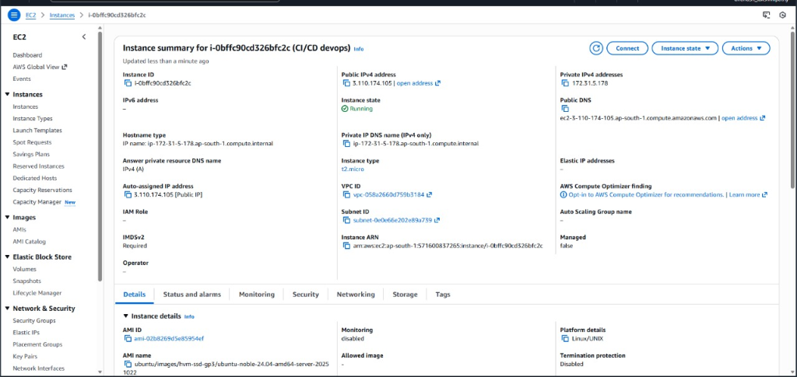
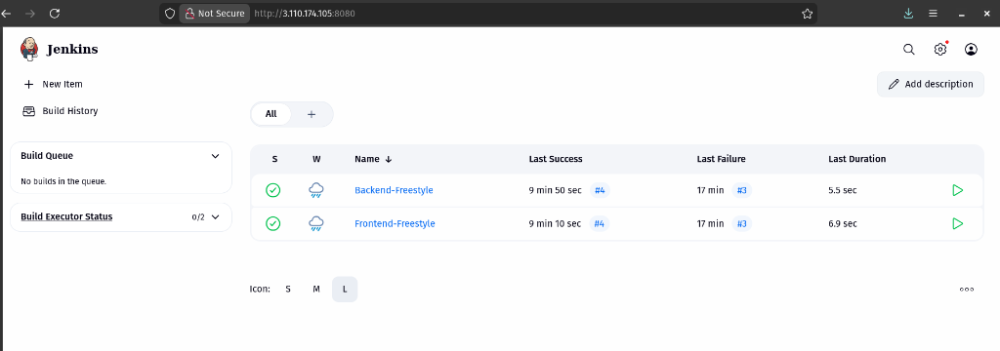
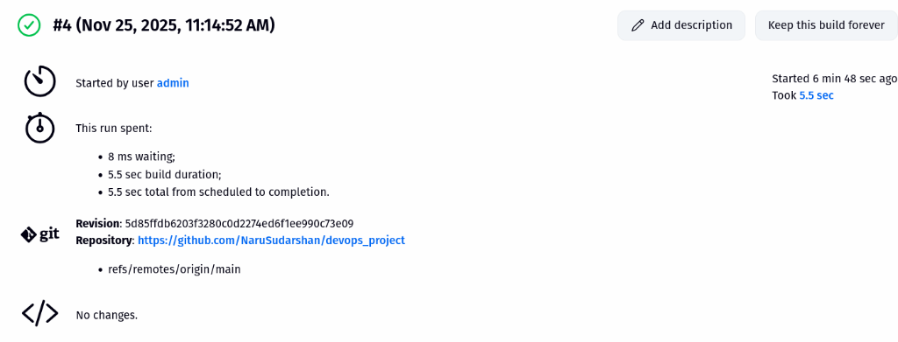
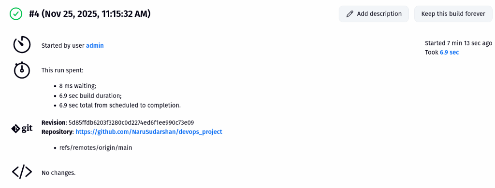

# DevOps Project: Node.js Frontend + Flask Backend

This is a simple web application with a Node.js/Express frontend and a Python/Flask backend. The frontend serves a contact form, and the backend handles the form submissions.

I've containerized both services using Docker and set up a CI/CD pipeline using Jenkins on an AWS EC2 instance.

## Quick Start (Docker)

If you want to run this locally, you can use the pre-built images from Docker Hub.

1.  **Pull the images:**
    ```bash
    docker pull sudarshan09/frontend-app:latest
    docker pull sudarshan09/backend-app:latest
    ```

2.  **Run with Docker Compose:**
    ```bash
    docker-compose up
    ```
    The frontend will be running at `http://localhost:3000`.

## Project Structure

*   `frontend/`: Node.js Express app (serves the UI).
*   `backend/`: Flask app (API for form handling).
*   `docker-compose.yaml`: Orchestrates the two services.
*   `terraform/`: Terraform configurations for AWS deployment.

---

## Deployment & CI/CD Setup

I deployed this on a single AWS EC2 instance (Ubuntu 22.04) and used Jenkins to automate the deployment process. Here's a breakdown of the setup.

### 1. Server Setup (EC2)
I used a `t2.micro` instance with Ubuntu 22.04.
*   **Ports Opened:** 22 (SSH), 80 (HTTP), 3000 (Frontend), 5000 (Backend), 8080 (Jenkins).
*   **Dependencies Installed:**
    *   Java (OpenJDK 21) for Jenkins.
    *   Node.js & npm for the frontend.
    *   Python3 & pip for the backend.
    *   `pm2` (globally installed) to keep the apps running in the background.

### 2. Jenkins Configuration
I set up Jenkins on port 8080 and created two "Freestyle" projects to handle the deployments.

*   **Backend Job:**
    *   Pulls code from the `main` branch.
    *   Installs Python requirements (using `--break-system-packages` for Ubuntu 24.04 compatibility).
    *   Restarts the Flask app using `pm2`.

*   **Frontend Job:**
    *   Pulls code from the `main` branch.
    *   Installs npm packages.
    *   Restarts the Express app using `pm2`.

Both jobs are triggered automatically by a **GitHub Webhook** whenever I push code to the repository.

## Screenshots

### Live Application (EC2)


### Jenkins Dashboard


### Build Logs
**Backend Build:**


**Frontend Build:**


## Logs

Here are snippets from the latest successful build logs:

**Frontend:**
```text
Started on Nov 25, 2025, 11:31:10 AM
Started by event from 140.82.115.12 ⇒ http://3.110.174.105:8080/github-webhook/ on Tue Nov 25 11:31:10 UTC 2025
Using strategy: Default
[poll] Last Built Revision: Revision 5d85ffdb6203f3280c0d2274ed6f1ee990c73e09 (refs/remotes/origin/main)
The recommended git tool is: NONE
No credentials specified
 > git --version # timeout=10
 > git --version # 'git version 2.43.0'
 > git ls-remote -h -- https://github.com/NaruSudarshan/devops_project # timeout=10
Found 1 remote heads on https://github.com/NaruSudarshan/devops_project
[poll] Latest remote head revision on refs/heads/main is: aa358898d714f0f2a918ffbe9ccaa30d8c587a61
Done. Took 0.9 sec
Changes found
```

**Backend:**
```text
Started on Nov 25, 2025, 11:31:10 AM
Started by event from 140.82.115.12 ⇒ http://3.110.174.105:8080/github-webhook/ on Tue Nov 25 11:31:10 UTC 2025
Using strategy: Default
[poll] Last Built Revision: Revision 5d85ffdb6203f3280c0d2274ed6f1ee990c73e09 (refs/remotes/origin/main)
The recommended git tool is: NONE
No credentials specified
 > git --version # timeout=10
 > git --version # 'git version 2.43.0'
 > git ls-remote -h -- https://github.com/NaruSudarshan/devops_project # timeout=10
Found 1 remote heads on https://github.com/NaruSudarshan/devops_project
[poll] Latest remote head revision on refs/heads/main is: aa358898d714f0f2a918ffbe9ccaa30d8c587a61
Done. Took 0.9 sec
Changes found
```

---

# AWS Terraform Deployment

This section documents the Terraform configurations used to deploy the application on AWS in three different ways.

## Prerequisites
- [Terraform](https://www.terraform.io/downloads) installed.
- [AWS CLI](https://docs.aws.amazon.com/cli/latest/userguide/getting-started-install.html) installed and configured with `aws configure`.
- [Docker](https://docs.docker.com/get-docker/) installed (for Part 3).

## Part 1: Single EC2 Instance
Deploys both applications on a single `t2.micro` instance.

### Deployment
1. Navigate to `terraform/part1`:
   ```bash
   cd terraform/part1
   ```
2. Initialize Terraform:
   ```bash
   terraform init
   ```
3. Apply the configuration:
   ```bash
   terraform apply
   ```
   Type `yes` to confirm.
4. Note the `public_ip` from the output.
5. Access the apps:
   - Frontend: `http://<public_ip>:3000`
   - Backend: `http://<public_ip>:5000`

## Part 2: Separate EC2 Instances
Deploys applications on two separate instances in a custom VPC.

### Deployment
1. Navigate to `terraform/part2`:
   ```bash
   cd terraform/part2
   ```
2. Initialize and Apply:
   ```bash
   terraform init
   terraform apply
   ```
3. Access the Frontend at `http://<frontend_public_ip>:3000`.

## Part 3: Docker, ECR, ECS
Deploys applications as Docker containers on ECS (EC2 Launch Type) with an ALB.

### Deployment
1. **Provision ECR Repositories**:
   ```bash
   cd terraform/part3
   terraform init
   terraform apply -target=aws_ecr_repository.backend -target=aws_ecr_repository.frontend
   ```
2. **Build and Push Docker Images**:
   Retrieve the repository URLs from the output.
   
   **Backend**:
   ```bash
   aws ecr get-login-password --region us-east-1 | docker login --username AWS --password-stdin <your-account-id>.dkr.ecr.us-east-1.amazonaws.com
   cd ../../backend
   docker build -t flask-backend .
   docker tag flask-backend:latest <ecr_backend_url>:latest
   docker push <ecr_backend_url>:latest
   ```

   **Frontend**:
   ```bash
   cd ../frontend
   docker build -t express-frontend .
   docker tag express-frontend:latest <ecr_frontend_url>:latest
   docker push <ecr_frontend_url>:latest
   ```

3. **Deploy Infrastructure**:
   ```bash
   cd ../terraform/part3
   terraform apply
   ```
4. Access the application via the `alb_dns_name` output.

## Cleanup
To destroy the resources, run `terraform destroy` in the respective directories.

## Terraform Files


- **`main.tf`**: This is the main recipe file. It tells AWS what resources we want to create (like servers, security groups, or load balancers).
- **`variables.tf`**: This file stores settings that might change, like the AWS region or the type of server (e.g., `t2.micro`). It makes the code cleaner and easier to update.
- **`outputs.tf`**: This file tells Terraform what information to show us after it finishes, like the public IP address of the server or the URL of the load balancer.

---

# Kubernetes Deployment (Minikube)

This section explains how to deploy the application locally using Minikube.

## Prerequisites
- [Minikube](https://minikube.sigs.k8s.io/docs/start/) installed and running.
- [kubectl](https://kubernetes.io/docs/tasks/tools/) installed.
- Docker installed.

## Deployment Steps

1.  **Start Minikube**:
    ```bash
    minikube start
    ```

2.  **Build Docker Images**:
    You need to build the images so Minikube can access them.
    ```bash
    # Build Backend
    cd backend
    docker build -t flask-backend:latest .
    
    # Build Frontend
    cd ../frontend
    docker build -t express-frontend:latest .
    ```

3.  **Load Images into Minikube**:
    Since Minikube runs in its own environment, we need to load the images into it.
    ```bash
    minikube image load flask-backend:latest
    minikube image load express-frontend:latest
    ```

4.  **Deploy to Kubernetes**:
    Apply the manifests located in the `k8s` directory.
    ```bash
    cd ../
    kubectl apply -f k8s/
    ```

5.  **Verify Deployment**:
    Check if the pods are running:
    ```bash
    kubectl get pods
    kubectl get services
    ```

6.  **Access the Application**:
    To access the frontend service (which is type `NodePort`), run:
    ```bash
    minikube service frontend-service
    ```
    This command will open the application in your default browser.

